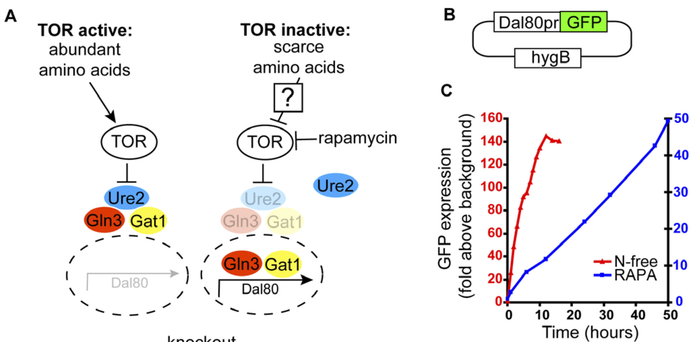

```{r}
library(tidyverse)
library(cowplot)
#library(ggplot2)
#library(dplyr)
#library(mgcv)
#library(broom)
```

## Background

In *S. cerevisiae*, it has been shown that the *DAL80* gene is controlled by the PP2A branch of TORC1. The gene encodes a transcriptional regulator that controls nitrogen degradation pathways. When cells are starved of nitrogen (but not if they are starved of glucose or treated with rapamycin), *DAL80* is induced, activating its downstream genes (PMC2686269).


The reason for using this reporter in our study is because TORC1 is known to have multiple downstream branches that are differentially regulated by the upstream signals (PMID: 25085507). Jinye already showed using P-Rps6 that TORC1 is inhibited by phosphate starvation in *C. glabrata* but not in *S. cerevisiae*. There is a debate on whether Rps6 phosphorylation is regulated by the Sch9 branch or by a third kinase called Yak3. Regardless, PP2A would be a separate branch and the *DAL80* reporter can tell us how that branch is affected by the signal in both species.

## Experimental design

Jinye constructed three strains:

| Genotype                     | Species         | Notes                                                               |
|:-----------------------------|:----------------|:-----------------------|
| Cgmsn2::ScDal80pr-yeGFP      | *C. glabrata*   | *S. cerevisiae DAL80pr*-GFP reporter integrated at the *msn2* locus |
| K699-pRS315-ScDal80pr-yeGFP  | *S. cerevisiae* | same reporter on a centrimeric plasmid in the K699 background       |
| S288C-pRS315-ScDal80pr-yeGFP | *S. cerevisiae* | same reporter on a centrimeric plasmid in the S288C background      |

In _C. glabrata_, Jinye found plasmid-born _ScDAL80-GFP_ reporter doesn't express well. She tried a few genomic loci for integration and found the results to vary. The final choice of _msn2::URA3_ locus is based on its stronger expression. It is worth noting that _msn2∆_ in _C. glabrata_ does not affect hydrogen peroxide resistance or the ASR phenotype, based on Jinye's earlier result. Therefore, we don't expect it to influence the TORC1 behavior in this assay. It would be nice to have a second genome-integrated strain to confirm the result.

## Data & QC

```{r, Import the Data into R}
files <- list.files("../input/ScDAL80-yeGFP-flow", pattern = "merge-", full.names = TRUE)
#names(files) <- paste0("Rep", 1:3)    # name the replicates
reps <- c("01/03/23","01/06/23","12/30/22")
# append replicate id to the files
names(files) <- reps 

tp <- c("0",  "30", "60", "90", "120", "150",  "180", "210", "240") # ordered time points

# import and process the data to the format we want
raw <- files %>% 
  map_dfr(~read_csv(., na = c("", "NA", "N/A"), col_types = cols()), .id = "replicate") %>% 
  filter(`X Parameter` == "BL1-H", is.na(`Y Parameter`)) %>% 
  select(replicate, plate = Plate, Group, well = Sample, 
         count = Count, median = `X Median`,  peak = `X Peak`, 
         sd = `X SD`, cv = `X %CV`, rCV = `X %rCV`) %>% 
  mutate(Time = ordered(Group, levels = paste0(tp, "min"), labels = tp),
         time = as.numeric(gsub("min", "", Group)),
         Group = NULL) %>% 
  arrange(time)
```

```{r, Subset the dataset and merge with the genotype information}
# get genotype info
sample <- dir("../input/ScDAL80-yeGFP-flow", pattern = "^d", full.names = TRUE)
names(sample) <- reps


treat <- sample %>% 
  map_dfr(~read_csv(., na = c("","NA","N/A"), col_types = cols()), .id = "replicate") %>% 
  filter(!is.na(group_name)) %>% 
  select(replicate, genotype = group_name, well = Sample, treat) %>% 
  mutate(species = ifelse(grepl("Cg", genotype), "C. glabrata", "S. cerevisiae"),
         strain = ifelse(species == "C. glabrata", "BG99",
                         gsub("-.*", "", genotype)),
         treat = fct_recode(treat, `-Nitrogen` = "0Nitrogen",
                            `-Pi` = "0Pi", Rich = "ctrl"))

# combine genotype and treat variables into the flow data
data <- left_join(raw, treat, by = c("replicate", "well")) %>% 
  separate(well, into = c("row", "column"), sep = 1)

# any unannotated rows?
data %>% filter(is.na(genotype) | is.na(treat))

write_tsv(data, file = "../input/ScDAL80-yeGFP-flow/20230131-DAL80-annotated-flow-cyto.tsv.gz")
```

Some samples have low cell count
```{r}
data %>% 
  ggplot(aes(x = row, y = count)) +
  geom_point(aes(color = genotype)) +
  facet_grid(treat~replicate) + 
  theme_bw(base_size = 14) + 
  theme(legend.position = "top") +
  guides(color = guide_legend(nrow = 2))
```
The genotypes are unfortunately confounded with the well positions here. We cannot tell if the cell density difference is due to one or another. But it's clear that row F consistently has low cell counts. Do the cell count correlate with the median fluorescent intensity?
```{r}
lm <- data %>%
  filter(genotype == "K699-pRS315-ScDal80pr-yeGFP") %>% 
  lm(median ~ treat + time + row + replicate, data = .)
summary(lm)
```
> rowF is clearly an outlier. it's justified to remove the row F data on the basis that they systematically showed lower cell count and lower fluorescence, most likely reflecting their growth state and not the biological effect of interest.
> also, replicates are not significantly differentiated from one another. we are going to pool all the data together.

## Plots
Common plotting functions
```{r}
p.timecourse <- list(
  stat_summary(aes(color = treat), fun = "mean", geom = "point", size = 2),
  stat_summary(aes(color = treat), 
               fun.data = "mean_cl_boot", geom = "errorbar", width = 2),
  stat_smooth(aes(color = treat),
              method = "loess", formula = 'y~x', se = FALSE),
  scale_x_continuous(breaks = seq(0,240,60)),
  scale_size_manual(values = c(0.8, 1.5), guide = "none"),
  scale_color_manual(name = "Treatment",
                     values = c("-Nitrogen" = "royalblue",
                                "-Pi" = "#9900FF",
                                "Rich" = "#666666")),
  labs(x = "", y = ""),
  theme_bw(base_line_size = 1.2, base_size = 14),
  theme(#legend.position=c(0.05,0.75), 
        #legend.box.background = element_rect(color = "black"),
        #legend.box.margin = margin(3,3,3,3),
        #legend.text = element_text(face = 3), 
        #legend.title = element_text(),
    strip.text = element_text(size = rel(1.2), face = 3),
    axis.title = element_text(size = rel(1)), 
    axis.title.x = element_blank(),
    axis.text.x = element_text(hjust=0.5), 
    axis.text = element_text(size = rel(1)),
    panel.grid.minor = element_blank()
  )
)
```

Nitrogen starvation
```{r}
p1 <- data %>% 
  filter(!is.na(median), row != "F", strain != "K699",
         treat %in% c("-Nitrogen", "-Pi", "Rich")) %>% 
  ggplot(aes(x = time, y = median, group = treat)) +
  p.timecourse + facet_wrap(~species, scales = "free_y")
  #ggtitle("Treatment: Nitrogen Starvation")

p2 <- data %>% 
  filter(!is.na(median), row != "F", strain != "K699",
         treat %in% c("-Pi", "Rich")) %>% 
  ggplot(aes(x = time, y = median, group = treat)) +
  p.timecourse + facet_wrap(~species, scales = "free_y")

plot_grid(p1, p2, NULL, nrow = 3, rel_heights = c(1, 1, 0.1), align = "hv") +
  draw_label("Time (min)", x = 0.5, y = 0, vjust = -0.5, angle = 0) +
  draw_label("ScDAL80-GFP MFI (a.u.)", x = 0, y = 0.5, vjust = 1.5, angle = 90)
ggsave("../output/20230201-DAL80-induction-kinetics.png", width = 8, height = 6)
```

